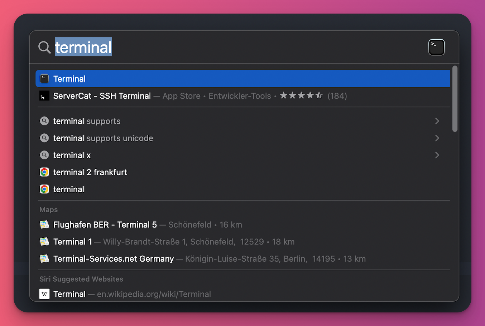

# Recipe-pick

## How To Build The Application

Open your terminal. In MacOS press `command(⌘) + space` to open the spotlight, type `Terminal` and enter.



Run this inside terminal to download the source code. If you don't have `git` installed, the system will prompt you to install it.

```shell
git clone https://github.com/fmhf/recipe-pick.git
```

Once the source code cloned to your computer, change the directory to the code. 
Here's how to navigate inside the terminal using `cd` command, `cd` is to change the directory.

```shell
cd recipe-pick
```


Once you're inside the source code directory, run this to install the application.

```shell
make install
```

Now you can run the application no matter where you are. You don't need to change the directory to run the application.

Still in the terminal, go to the place where you place the `config.yaml` file, and run it like this.

```shell
recipe-pick -f example.csv
```